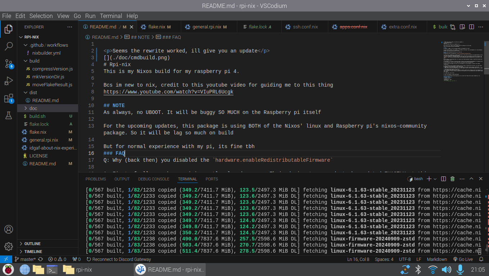

<p>It dosent successfuly build on github action, but weirdly it does on my raspberry pi</p>
<p>js bcs of 'git: folder is not a repo'</p>

```
+ sudo nix build .#nixosConfigurations.rpi-nix.config.system.build.sdImage --extra-experimental-features nix-command --extra-experimental-features flakes
warning: Not a git repository. Use --no-index to compare two paths outside a working tree
usage: git diff --no-index [<options>] <path> <path>
```



# Rpi-nix
This is my Nixos build for my raspberry pi 4.

Bcs im new to nix, credit to this youtube video for guiding me to this thing
https://www.youtube.com/watch?v=VIuPRL6Ucgk

## FAQ
Q: Why (back then) you disabled the `hardware.enableRedistributableFirmware`

A: First of all, raspberry pi is mostly closed source. Their device tree needs to be updated EXACTLY at this repo https://github.com/raspberrypi/firmware.
If you try to enable it, the kernel panics when they cant access some Broadcom closed-source programs like `brcmfmac` https://github.com/NixOS/nixpkgs/issues/122993#issuecomment-1221414184 (go to the bottom of the page)

But the thing is, some program that i use requires the redistributeable firmware, to make the wireless work (wifi, bluetooth, etc)

For developers, if you want to see how pi boots, check out this person from the Raspberry Pi Foundation (hes an actual Engineer) https://forums.raspberrypi.com/viewtopic.php?t=329799#p1974233

Q: Why (for the next update) you want to use the Raspberry pi nixos-community, instead of your manual configuration 

A: https://github.com/nix-community/raspberry-pi-nix To make it upstream with the kernel, just that simple. But because of some consideration i would need to see
1. UBOOT fails to work with some newer pi, like RPi4B with the latest revision model, and the RPi5
<br>Some other finds that the RPi4b works, but other people (like me) finds the RPi4b dosent work with UBOOT

2. Racing with always-updated startup files
<br>Ex. EEPROM, Device tree, and .elf file that is mostly closed source (related to the first question)<br>I mean, the files are always provided & updated by that repository, but the implementation sadly ALWAYS changes every update

So.. maybe later. But not now

Q: Does this package is always maintained?

A: Not to be guaranteed with that question, but i do test this flake with my actual raspberry pi. So, **partially yes**
## Minimum requirements
| Category | Size |
| :--- | ---- |
| Storage size | 32gb | 
| RAM | 6gb |
<!-- ik the kde jokes, just stfu -->
